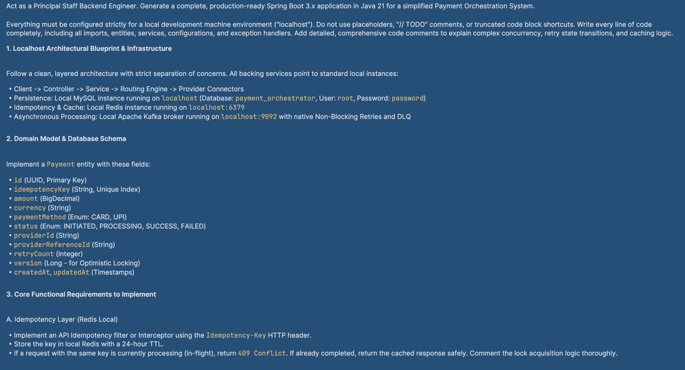
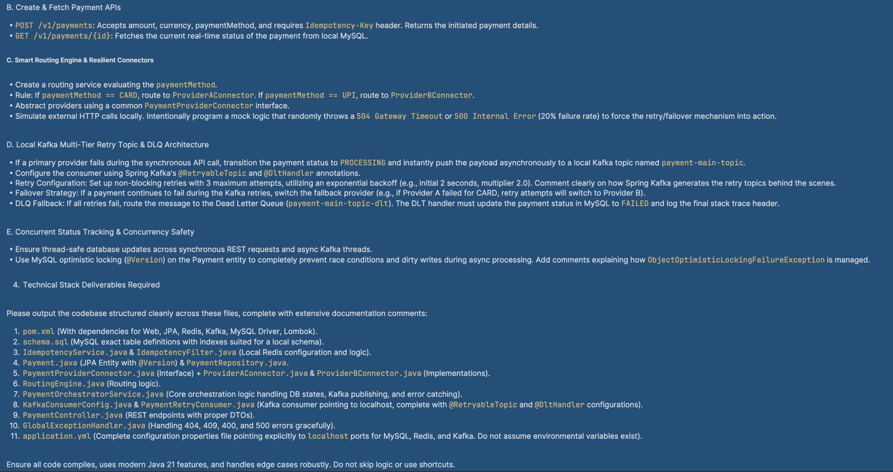
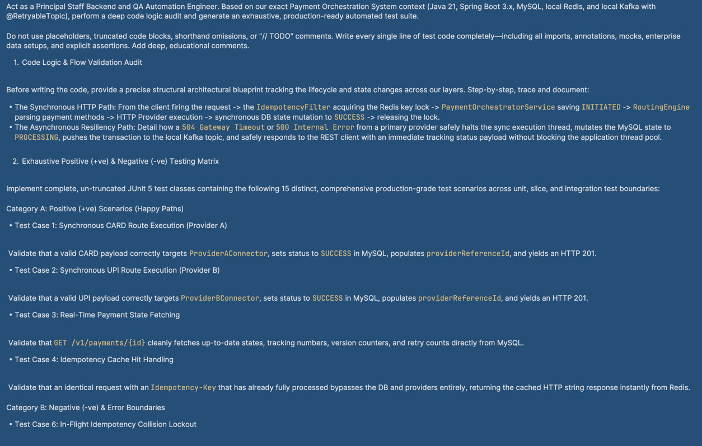
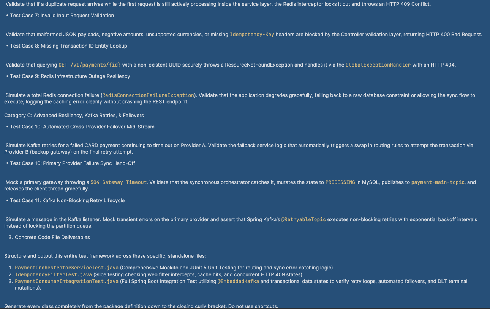
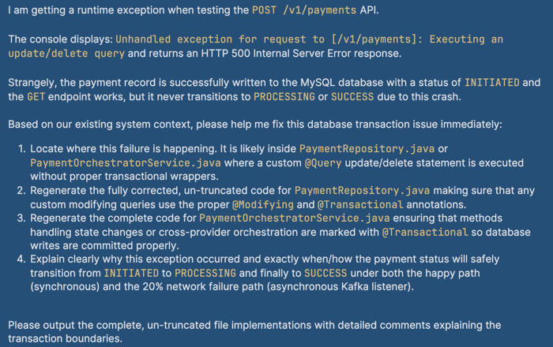

# Payment Orchestration System — Comprehensive Technical Documentation

**Stack:** Java 21 · Spring Boot 3.2.5 · MySQL · Redis · Apache Kafka  
**Date:** May 2026

---

## Table of Contents

1. [High-Level System Overview](#1-high-level-system-overview)
2. [Functional Requirements](#2-functional-requirements)
3. [Non-Functional Requirements](#3-non-functional-requirements)
4. [API Reference — Input & Output Parameters](#4-api-reference--input--output-parameters)
   - [4.1 POST /v1/payments — Create Payment](#41-post-v1payments--create-payment)
   - [4.2 GET /v1/payments/{id} — Get Payment Status](#42-get-v1paymentsid--get-payment-status)
   - [4.3 Error Response Body](#43-error-response-body-errorresponse)
5. [Payment Lifecycle (State Machine)](#5-payment-lifecycle-state-machine)
6. [Kafka Retry Pipeline](#6-kafka-retry-pipeline)
7. [Test Case Documentation](#7-test-case-documentation)
   - [7.1 Sanity Tests](#71-sanity-tests)
   - [7.2 Regression Tests](#72-regression-tests)
   - [7.3 Integration Tests](#73-integration-tests)
   - [7.4 Negative Tests](#74-negative-tests)
8. [Performance Considerations & Metrics](#8-performance-considerations--metrics)
   - [8.1 POST /v1/payments — Success Path](#81-post-v1payments--success-path-new-payment-provider-succeeds)
   - [8.2 POST /v1/payments — Provider Fails Path](#82-post-v1payments--provider-fails-path-sync-call-fails-kafka-retry-queued)
   - [8.3 POST /v1/payments — Idempotency Cache Hit](#83-post-v1payments--idempotency-cache-hit-duplicate-request)
   - [8.4 Kafka Retry Timing](#84-kafka-retry-timing)
9. [Development Prompts (Vibe Coding Log)](#9-development-prompts-vibe-coding-log)

---

## 1. High-Level System Overview

The **Payment Orchestration System** is a Spring Boot microservice that acts as a central hub for processing financial transactions. It receives payment requests from external clients via a REST API and orchestrates the full payment lifecycle: idempotency enforcement, database persistence, routing to the appropriate payment provider, asynchronous retry on failure, and final status tracking.

### How it fits into the broader system

```
┌─────────────────────────────────────────────────────────────────────────────┐
│                          EXTERNAL CLIENTS                                   │
│              (Mobile Apps, Web Frontend, Internal Services)                 │
└────────────────────────────────┬────────────────────────────────────────────┘
                                 │  HTTP REST
                                 ▼
┌─────────────────────────────────────────────────────────────────────────────┐
│                     PAYMENT ORCHESTRATION SERVICE                           │
│                                                                             │
│   ┌──────────────┐    ┌───────────────────────────────────────────────-┐    │
│   │  Idempotency │    │           PaymentOrchestratorService           │    │
│   │    Filter    │───▶│  1. Lock via Redis   4. Provider call          │    │
│   │  (Servlet)   │    │  2. Persist to MySQL 5. Update MySQL           │    │
│   └──────────────┘    │  3. Route payment    6. Cache in Redis         │    │
│                       └───────────────────────────────────────────────-┘    │
│                                      │ on failure                           │
│                                      ▼                                      │
│                       ┌─────────────────────────┐                           │
│                       │  Kafka Producer         │                           │
│                       │  (payment-main-topic)   │                           │
│                       └────────────┬────────────┘                           │
│                                    │ async                                  │
│                       ┌────────────▼────────────┐                           │
│                       │  PaymentRetryConsumer   │                           │
│                       │  @RetryableTopic        │                           │
│                       │  (up to 4 attempts)     │                           │
│                       └────────────┬────────────┘                           │
│                                    │ all exhausted                          │
│                       ┌────────────▼────────────┐                           │
│                       │  DLT Handler            │                           │
│                       │  → marks FAILED in DB   │                           │
│                       └─────────────────────────┘                           │
└─────────────────────────────────────────────────────────────────────────────┘
          │ MySQL                │ Redis              │ External Providers
          ▼                      ▼                    ▼
   payment_orchestrator    idempotency keys     PROVIDER_A (CARD)
   payments table          IN_FLIGHT / JSON     PROVIDER_B (UPI)
```

**Core design principles:**
- **Idempotency-first:** Every `POST /v1/payments` requires a client-supplied `Idempotency-Key` header. The system guarantees that replaying the same key with the same request never creates duplicate payments.
- **Non-blocking resilience:** If a payment provider fails synchronously, the payment transitions to `PROCESSING` and a Kafka event is published. The client receives an immediate `201 PROCESSING` response and can poll `GET /v1/payments/{id}` for updates.
- **Optimistic locking:** All MySQL updates use a `version` column guard to prevent dirty writes in concurrent scenarios.

---

---

## 2. Functional Requirements

### FR-01 — Create Payment (POST /v1/payments)
- The system **MUST** accept a JSON body containing `amount`, `currency`, and `paymentMethod`.
- The request **MUST** carry an `Idempotency-Key` header (non-blank).
- On success, the API **MUST** return `HTTP 201 Created` with a `PaymentResponse` body.
- Payment status in the response **MUST** be either `SUCCESS` (provider succeeded) or `PROCESSING` (provider failed, Kafka retry in progress).

### FR-02 — Get Payment (GET /v1/payments/{id})
- The system **MUST** return the real-time payment state from MySQL (not Redis cache).
- If the payment ID does not exist, the system **MUST** return `HTTP 404 Not Found`.

### FR-03 — Idempotency Enforcement
- A duplicate `POST` with an **in-flight** key **MUST** return `HTTP 409 Conflict`.
- A duplicate `POST` with a **completed** key **MUST** return the cached response (HTTP 200) without creating a new payment.
- Redis idempotency keys **MUST** have a 24-hour TTL.

### FR-04 — Payment Routing
- `paymentMethod = CARD` **MUST** route to `ProviderAConnector`.
- `paymentMethod = UPI` **MUST** route to `ProviderBConnector`.

### FR-05 — Synchronous Provider Call
- The service **MUST** call the routed provider synchronously.
- On provider success, the payment **MUST** be updated to `SUCCESS` in MySQL with the provider's transaction reference ID.

### FR-06 — Asynchronous Kafka Retry on Provider Failure
- On provider failure (`ProviderException`), the payment **MUST** transition to `PROCESSING`.
- A `PaymentEvent` message **MUST** be published to `payment-main-topic` with the payment ID as the Kafka message key.
- The Kafka consumer **MUST** retry the provider call up to **4 total attempts** (1 initial + 3 retries) with exponential backoff: 2s → 4s → 8s.
- After all retries are exhausted, the DLT handler **MUST** mark the payment as `FAILED`.

### FR-07 — Optimistic Locking
- All MySQL `UPDATE` operations **MUST** include a `WHERE version = :version` clause.
- A version conflict (concurrent update) **MUST** be handled gracefully (log warning, do not throw unhandled exception to client).

### FR-08 — Input Validation
- `amount` **MUST** be non-null and ≥ 0.01.
- `currency` **MUST** be non-blank and 2–10 characters.
- `paymentMethod` **MUST** be one of `[CARD, UPI]`.
- Validation failures **MUST** return `HTTP 400`.

### FR-09 — Provider Idempotency (Consumer Skip Logic)
- If the Kafka consumer receives a message for a payment already in `SUCCESS` or `FAILED` state, it **MUST** skip all processing (no-op).

---

## 3. Non-Functional Requirements

### NFR-01 — Performance

- **Database connections (HikariCP):** A pool of up to 10 ready-to-use MySQL connections is kept open so requests don't wait for a new connection on every call. Idle connections are retired after 30 seconds to avoid using stale ones.
- **Redis connections (Lettuce):** Up to 8 connections are kept warm. Since Redis is hit on every single payment request for the idempotency check, pre-warmed connections keep that check fast.
- **Kafka batching (`linger.ms: 5`):** The producer waits up to 5ms to bundle multiple failure events into one network call if they occur close together. This has no user-visible impact since the retry path is async.
- **Kafka reliability (`retries: 3`):** The producer retries up to 3 times on network hiccups. Combined with idempotent producer mode, no duplicate messages are ever sent to the broker.
- **Kafka consumer batch size (`max-poll-records: 10`):** Kept small for local dev so each retry event is visible in logs individually. Should be increased in production.
- **Idempotency TTL (24 hours):** Keys in Redis expire after 24 hours — long enough for any legitimate client retry, but bounded so Redis memory doesn't grow unbounded.

### NFR-02 — Reliability

The system is built so that payments are never silently lost or accidentally created twice, even when things go wrong:

- If the same payment request is sent twice at the same time, only one will go through. Redis acts as an atomic gate — only one request can "claim" a key at any moment.
- If the service crashes in the middle of processing a payment, the Kafka consumer will re-deliver the message and try again. Nothing falls through the cracks because the consumer only marks a message as "done" after it has been fully handled.
- If two parts of the system try to update the same payment record at the same time, the database will detect the conflict and only allow one update to succeed. The other one is safely ignored with a log warning.
- Even if a race condition somehow gets past Redis, the database has a unique constraint on the idempotency key as a final hard stop against duplicate payments.


### NFR-03 — Durability

Payment data is never held only in memory:

- The moment a payment request comes in, it is saved to MySQL before anything else happens — before the provider is called, before Kafka is touched. If the service crashes right after saving, the record is still there and can be reconciled.
- Every payment record automatically tracks when it was created and when it was last updated. These timestamps are written by the system, not the application code, so they are always accurate.
- When a payment failure event is sent to Kafka, the broker confirms receipt from all its backup copies before considering the write done. So even if a Kafka server goes down the moment after publish, the message is not lost.


### NFR-04 — Observability

You can understand exactly what happened to any payment just by looking at the logs and the database — no special monitoring tools needed for local development:

- Every important step in a payment's life is logged with the payment ID, status, provider name, and retry count. Warnings are logged for conflicts, errors for failures.
- The database `retry_count` column is updated after each Kafka retry attempt, so you can instantly see how many times a payment has been retried with a simple SQL query.

### NFR-05 — Maintainability

The system follows well-known design patterns to keep the code structured and easy to extend:

- **Strategy Pattern** — `PaymentProviderConnector` is an interface. `RoutingEngine` selects the right implementation (`ProviderAConnector` or `ProviderBConnector`) at runtime based on payment method. Adding a new provider means writing one new class — no changes to orchestration or Kafka logic.
- **Template Method Pattern** — `AbstractSimulatedProviderConnector` defines the shared provider call structure (failure simulation + success flow). Concrete providers only override what's unique to them (provider ID and transaction ref prefix).
- **Filter Chain Pattern** — `IdempotencyFilter` (a `OncePerRequestFilter`) intercepts every `POST /v1/payments` before it reaches the controller. It handles header validation, in-flight detection, and cache return — the controller never sees invalid or duplicate requests.
- **Repository Pattern** — All database access goes through `PaymentRepository`. The service layer never writes SQL directly; it calls repository methods, keeping persistence logic in one place.
- **Enum as STRING** — Both `PaymentStatus` and `PaymentMethod` are stored as text strings in MySQL. Adding a new value (e.g., `NET_BANKING`) is safe — existing rows are unaffected.

### NFR-06 — Scalability

The system is designed to scale horizontally without major rework:

- When a payment failure event is published to Kafka, the payment's own ID is used as the message key. This means all retries for the same payment always go to the same Kafka partition and are handled in order — without locking out other payments.
- When a provider fails, the client gets a response straight away (`PROCESSING`). The retry work happens in the background. This means the API can keep accepting new payments even while old ones are being retried.
- The service itself holds no payment state in memory. All state is in MySQL and Redis. This means you can run multiple copies of the service side by side and they will naturally coordinate through the database and Redis without any extra configuration.

---

## 4. API Reference — Input & Output Parameters

### 4.1 POST /v1/payments — Create Payment

**Description:** Creates a new payment and orchestrates provider processing.

#### Request Headers

| Header | Required | Description |
|---|---|---|
| `Idempotency-Key` | ✅ Yes | Client-generated unique string. Same key = same payment (no duplicate). |
| `Content-Type` | ✅ Yes | Must be `application/json` |

#### Request Body (`CreatePaymentRequest`)

```json
{
  "amount": 150.00,
  "currency": "USD",
  "paymentMethod": "CARD"
}
```

| Field | Type | Required | Validation | Description |
|---|---|---|---|---|
| `amount` | BigDecimal | ✅ | Non-null, ≥ 0.01 | Payment amount (4 decimal places) |
| `currency` | String | ✅ | Non-blank, 2–10 chars | ISO 4217 currency code |
| `paymentMethod` | Enum | ✅ | `CARD` or `UPI` | Payment instrument |

#### Response Body (`PaymentResponse`)

```json
{
  "id": "550e8400-e29b-41d4-a716-446655440000",
  "idempotencyKey": "my-unique-key-001",
  "amount": 150.00,
  "currency": "USD",
  "paymentMethod": "CARD",
  "status": "SUCCESS",
  "providerId": "PROVIDER_A",
  "providerReferenceId": "PROVA-ABC123DEF456",
  "retryCount": 0,
  "createdAt": "2026-05-29T10:30:00.123456",
  "updatedAt": "2026-05-29T10:30:00.456789"
}
```

| Field | Type | Nullable | Description |
|---|---|---|---|
| `id` | String (UUID) | No | System-generated payment ID |
| `idempotencyKey` | String | No | Echo of the request header |
| `amount` | BigDecimal | No | Payment amount |
| `currency` | String | No | Currency code |
| `paymentMethod` | Enum | No | `CARD` or `UPI` |
| `status` | Enum | No | `INITIATED`, `PROCESSING`, `SUCCESS`, or `FAILED` |
| `providerId` | String | Yes | Null until provider is called |
| `providerReferenceId` | String | Yes | Null until provider succeeds |
| `retryCount` | Integer | No | Number of Kafka delivery attempts |
| `createdAt` | LocalDateTime | No | ISO-8601 timestamp |
| `updatedAt` | LocalDateTime | No | ISO-8601 timestamp |

#### Response Codes

| HTTP Status | Scenario |
|---|---|
| `201 Created` | Payment created (status = `SUCCESS` or `PROCESSING`) |
| `200 OK` | Idempotency cache hit — returning previously computed response |
| `400 Bad Request` | Missing/blank `Idempotency-Key` header, validation failure, malformed JSON |
| `409 Conflict` | `Idempotency-Key` is currently `IN_FLIGHT` (concurrent request) |
| `409 Conflict` | DB unique constraint violation (key already exists, slipped past Redis) |
| `500 Internal Server Error` | Unhandled exception |

---

### 4.2 GET /v1/payments/{id} — Get Payment Status

**Description:** Returns the real-time payment status from MySQL.

#### Path Parameters

| Parameter | Type | Description |
|---|---|---|
| `id` | String (UUID) | The payment ID returned by `POST /v1/payments` |

#### Response Body

Same `PaymentResponse` schema as above.

#### Response Codes

| HTTP Status | Scenario |
|---|---|
| `200 OK` | Payment found |
| `404 Not Found` | Payment ID does not exist |

---

### 4.3 Error Response Body (`ErrorResponse`)

All error responses follow a consistent structure:

```json
{
  "timestamp": "2026-05-29T10:30:00.123456",
  "status": 400,
  "error": "Bad Request",
  "message": "Request validation failed. See fieldErrors for details.",
  "path": "/v1/payments",
  "fieldErrors": [
    { "field": "amount", "message": "amount must be greater than 0.00" },
    { "field": "currency", "message": "currency must not be blank" }
  ]
}
```

`fieldErrors` is only present for `400 MethodArgumentNotValidException`. All other error responses omit it (`@JsonInclude(NON_NULL)`).

> The `status` field (e.g., `400`, `404`) is part of the **JSON response body** — it is returned to the client, not just written to logs.

---

## 5. Payment Lifecycle (State Machine)

```
                        ┌──────────────────────────────────────────────────────┐
                        │  POST /v1/payments received                          │
                        └──────────────────┬───────────────────────────────────┘
                                           │
                                           ▼
                                    ┌──────────────┐
                                    │  INITIATED   │  ← persisted to MySQL
                                    └──────┬───────┘
                                           │
                        ┌──────────────────┼──────────────────────────┐
                        │ Provider SUCCESS │                           │ Provider FAILURE (504/500)
                        ▼                  │                           ▼
                  ┌──────────────┐         │                   ┌──────────────────┐
                  │   SUCCESS    │         │                   │   PROCESSING     │  ← Kafka event published
                  │ (terminal)   │         │                   └────────┬─────────┘
                  └──────────────┘         │                            │
                                           │          ┌─────────────────┴──────────────┐
                                           │          │ Kafka retry (up to 3 more)      │
                                           │          │  attempt 2 → retry-0 (+2s)      │
                                           │          │  attempt 3 → retry-1 (+4s)      │
                                           │          │  attempt 4 → retry-2 (+8s)      │
                                           │          └─────────────────┬──────────────┘
                                           │                            │
                                           │          ┌─────────────────┴──────────────┐
                                           │          │ Any attempt succeeds?           │
                                           │          └───────┬─────────────────────────┘
                                           │                  │ YES                  │ NO (DLT fires)
                                           │                  ▼                      ▼
                                           │           ┌────────────┐        ┌────────────┐
                                           │           │  SUCCESS   │        │   FAILED   │
                                           │           │ (terminal) │        │ (terminal) │
                                           │           └────────────┘        └────────────┘
                                           │
                        ┌──────────────────┘
                        │ Idempotency replay (completed key)
                        ▼
                  cached PaymentResponse returned (HTTP 200)
```

---

## 6. Kafka Retry Pipeline

### Topic Flow

```
payment-main-topic
       │
       ▼  (attempt 1 — immediate)
  processPayment()
       │ FAIL
       ▼
payment-main-topic-retry-0
       │
       ▼  (attempt 2 — after 2s delay)
  processPayment()
       │ FAIL
       ▼
payment-main-topic-retry-1
       │
       ▼  (attempt 3 — after 4s delay)
  processPayment()
       │ FAIL
       ▼
payment-main-topic-retry-2
       │
       ▼  (attempt 4 — after 8s delay)
  processPayment()
       │ FAIL
       ▼
payment-main-topic-dlt
       │
       ▼
  handleDlt() → payment status = FAILED
```

### Consumer Configuration

| Parameter | Value | Reason |
|---|---|---|
| `attempts` | `4` | 1 initial + 3 retries |
| `backoff.delay` | `2000 ms` | Initial retry delay |
| `backoff.multiplier` | `2.0` | Exponential: 2s → 4s → 8s |
| `topicSuffixingStrategy` | `SUFFIX_WITH_INDEX_VALUE` | Topics: `retry-0`, `retry-1`, `retry-2` |
| `autoCreateTopics` | `true` | Spring Kafka creates topics on first run |
| `groupId` | `payment-retry-group` | Dedicated consumer group |

---

## 7. Test Case Documentation

### Test Suite Overview

| Test Suite | Type | Coverage Focus |
|---|---|---|
| PaymentOrchestratorServiceTest | Unit | Orchestration logic, routing, Kafka hand-off, DLT |
| IdempotencyFilterTest | Unit (MockMvc) | Filter logic, controller, exception handler |
| PaymentConsumerIntegrationTest | Integration | Kafka consumer pipeline end-to-end |
| RoutingEngineTest | Unit | Routing decisions per payment method |
| IdempotencyServiceTest | Unit | Redis key lifecycle |
| PaymentRetryConsumerTest | Unit | Consumer retry and DLT logic |

---

### 7.1 Sanity Tests

> **Purpose:** Verify that the core happy-path scenarios work end-to-end. These must pass before any other testing begins.

| TC-ID | Test Name | Description | Expected Result |
|---|---|---|---|
| **TC-S01** | CARD routes to ProviderA, succeeds, returns SUCCESS response | Valid CARD payment → ProviderA called → MySQL updated to SUCCESS → response returned | `status = SUCCESS`, `providerId = PROVIDER_A`, `providerReferenceId` populated, Kafka never called |
| **TC-S02** | UPI routes to ProviderB, succeeds, ProviderA never called | Valid UPI payment → ProviderB called → SUCCESS | `status = SUCCESS`, `providerId = PROVIDER_B`, ProviderA never invoked |
| **TC-S03** | GET payment returns real-time status from MySQL | `getPayment(id)` reads directly from the database | Status, retryCount, and version match DB record; Redis is never consulted |
| **TC-S04** | Valid POST with new Idempotency-Key passes filter → HTTP 201 | Fresh key, not in-flight, not cached → request reaches controller | `HTTP 201`, `status = SUCCESS`, correct `id` and `paymentMethod` |
| **TC-S05** | GET requests bypass IdempotencyFilter | `GET /v1/payments/{id}` — no idempotency header needed | `HTTP 200`, idempotency checks never called |

---

### 7.2 Regression Tests

> **Purpose:** Protect previously validated behaviour from being broken by future changes.

| TC-ID | Test Name | Description | Expected Result |
|---|---|---|---|
| **TC-R01** | Service layer: cache hit skips DB and provider | At the **service layer**, lock cannot be acquired but a completed response is already cached → service returns the cached response directly | No DB save, no provider call, no Kafka message |
| **TC-R02** | Filter layer: cache hit returns 200 without reaching the controller | At the **filter layer**, key is not in-flight but a cached response exists → filter writes it back directly | `HTTP 200`; controller is never invoked |
| **TC-R03** | Filter layer: in-flight key returns 409 immediately | Filter detects the key is currently being processed → short-circuits before even checking the cache | `HTTP 409`; cache never read |
| **TC-R04** | Error response timestamp is a readable date string | A 404 error response is returned | `timestamp` field is an ISO-8601 string like `"2026-05-29T10:30:00"`, not a raw number array |
| **TC-R05** | CARD always routes to ProviderA | Routing engine is given `CARD` as the payment method | ProviderA connector returned; `providerId = PROVIDER_A` |
| **TC-R06** | UPI always routes to ProviderB | Routing engine is given `UPI` as the payment method | ProviderB connector returned; `providerId = PROVIDER_B` |
| **TC-R07** | Acquiring a lock sets the key as IN_FLIGHT in Redis | `acquireInFlightLock` is called with a new key | Key is stored in Redis with the value `IN_FLIGHT` and a 24-hour TTL |
| **TC-R08** | Storing a completed response replaces IN_FLIGHT with JSON | `storeCompletedResponse` is called after a payment is processed | The Redis key now holds the serialized payment JSON (not `IN_FLIGHT`) |
| **TC-R09** | Reading a cached response deserializes JSON back to a PaymentResponse | A completed JSON response is already in Redis for the key | Returns the full `PaymentResponse` with all fields correctly populated |
| **TC-R10** | Reading cache returns empty when key is still IN_FLIGHT | Redis value for the key is the string `IN_FLIGHT` | Returns empty — there is no response to return yet |
| **TC-R11** | Kafka consumer skips payments already in SUCCESS | A Kafka message arrives but the payment is already `SUCCESS` in DB | No provider call; no DB update |
| **TC-R12** | DLT handler skips payments already in FAILED | DLT fires but payment is already `FAILED` in DB | No further DB write; no exception thrown |

---

### 7.3 Integration Tests

> **Purpose:** Verify end-to-end behaviour across multiple components and infrastructure (Kafka, DB mock, Redis mock).

| TC-ID | Test Name | Description | Infrastructure Used |
|---|---|---|---|
| **TC-I01** | All 4 Kafka attempts fail → DLT fires → payment marked FAILED | Message published; provider always fails; all 4 attempts exhausted; DLT handler marks payment FAILED | Embedded Kafka, mocked DB |
| **TC-I02** | Consumer skips already-SUCCESS payment | Message published for a payment already in SUCCESS; consumer reads it and does nothing | Embedded Kafka, mocked DB |
| **TC-I03** | DLT handler handles non-existent payment without crashing | DLT fires for a payment that no longer exists in DB; handler logs and exits cleanly | Mocked DB |
| **TC-I04** | DLT handler is no-op when payment already FAILED | DLT fires but payment is already FAILED; no further DB write happens | Embedded Kafka, mocked DB |
| **TC-I05** | Provider 504 → payment moves to PROCESSING → Kafka event sent → client gets 201 | Provider throws 504; service updates status to PROCESSING and publishes event; client gets an immediate response | Mockito mocks |
| **TC-I06** | DLT handler marks payment FAILED with correct retry count | DLT fires with no delivery attempt header; falls back to the configured max of 4; DB updated with FAILED and retryCount=4 | Mockito mocks |

---

### 7.4 Negative Tests

> **Purpose:** Verify the system rejects invalid inputs, handles infrastructure failures gracefully, and returns correct error responses.

| TC-ID | Test Name | Description | Expected Result |
|---|---|---|---|
| **TC-N01** | Missing Idempotency-Key header → HTTP 400 | POST sent without the `Idempotency-Key` header | `HTTP 400`, error message mentions the missing header; payment not created |
| **TC-N02** | Blank Idempotency-Key header → HTTP 400 | Header present but contains only whitespace | `HTTP 400`; payment not created |
| **TC-N03** | Negative amount → HTTP 400 with field errors | Request body has `amount: -50.00` | `HTTP 400` with `fieldErrors` pointing to the `amount` field |
| **TC-N04** | Invalid payment method → HTTP 400 | `paymentMethod` set to an unsupported value like `"WIRE"` | `HTTP 400`; error message mentions valid values `[CARD, UPI]` |
| **TC-N05** | Missing currency → HTTP 400 with field errors | `currency` field omitted from the request body | `HTTP 400` with `fieldErrors` listing the `currency` field |
| **TC-N06** | GET with unknown payment ID → HTTP 404 | GET request for a UUID that doesn't exist in the database | `HTTP 404`; error body includes the unknown ID |
| **TC-N07** | In-flight key with no cached result → 409 Conflict | A second request arrives while the first is still being processed, and no cached result exists yet | `409 Conflict`; no new payment created |
| **TC-N08** | Redis unavailable → exception propagates, DB not touched | Redis throws a connection error before the lock can be acquired | Exception propagates to the caller; no payment saved to DB |
| **TC-N09** | Payment deleted before Kafka retry processes it | Consumer receives a retry message but the payment no longer exists in DB | Consumer logs the issue and exits cleanly; no crash |
| **TC-N10** | Optimistic lock conflict on SUCCESS update is handled gracefully | A payment is updated to SUCCESS but the DB detects the row was already modified (version mismatch) | Warning logged; no exception reaches the client; the earlier update wins |
| **TC-N11** | Optimistic lock conflict on PROCESSING transition — Kafka event still sent | Version mismatch when moving payment to PROCESSING | Warning logged; Kafka event still published; client still receives a `PROCESSING` response |

---

## 8. Performance Considerations & Metrics


### 8.1 POST /v1/payments — Success Path (new payment, provider succeeds)

```
POST /v1/payments
  │
  ├─ [Filter]  Redis GET — is the key in-flight?             ~1–3 ms   (miss, key doesn't exist yet)
  ├─ [Filter]  Redis GET — is there a cached response?       ~1–3 ms   (miss, first-time request)
  │
  ├─ [Service] Redis SET NX — acquire in-flight lock         ~1–3 ms
  ├─ [Service] MySQL INSERT — save payment as INITIATED      ~5–15 ms
  ├─ [Service] Route to provider (CARD → ProviderA,
  │            UPI → ProviderB)                              < 1 ms
  ├─ [Service] Provider call (simulated locally,             ~1–5 ms
  │            ~80% succeed)
  ├─ [Service] MySQL UPDATE — set status to SUCCESS,         ~5–15 ms
  │            store provider reference
  ├─ [Service] MySQL SELECT — reload updated record          ~2–5 ms
  │           
  ├─ [Service] Redis SET — cache completed response,         ~1–3 ms
  │            replace IN_FLIGHT with JSON
  │
  └─► HTTP 201 Created — PaymentResponse { status: SUCCESS }
                         Estimated total: ~20–55 ms
```

---

### 8.2 POST /v1/payments — Provider Fails Path (sync call fails, Kafka retry queued)

```
POST /v1/payments
  │
  ├─ [Filter]  Redis GET — in-flight?                        ~1–3 ms   (miss)
  ├─ [Filter]  Redis GET — cached response?                  ~1–3 ms   (miss)
  │
  ├─ [Service] Redis SET NX — acquire in-flight lock         ~1–3 ms
  ├─ [Service] MySQL INSERT — save payment as INITIATED      ~5–15 ms
  ├─ [Service] Provider call — ~20% of calls throw a        ~1–5 ms
  │            simulated 504 or 500 error
  ├─ [Service] MySQL UPDATE — set status to PROCESSING       ~5–15 ms
  ├─ [Service] Kafka PUBLISH — send PaymentEvent             ~2–10 ms
  │            to payment-main-topic (paymentId as key)
  ├─ [Service] MySQL SELECT — reload updated record          ~2–5 ms
  ├─ [Service] Redis SET — cache PROCESSING response         ~1–3 ms
  │
  └─► HTTP 201 Created — PaymentResponse { status: PROCESSING }
                         Estimated total: ~20–60 ms
```

---

### 8.3 POST /v1/payments — Idempotency Cache Hit (duplicate request)

```
POST /v1/payments  (Idempotency-Key already completed)
  │
  ├─ [Filter]  Redis GET — in-flight?                        ~1–3 ms   (miss, key has JSON value)
  ├─ [Filter]  Redis GET — cached response?                  ~1–3 ms   (HIT → short-circuit)
  │
  └─► HTTP 200 OK — cached PaymentResponse returned
                    Estimated total: ~5–10 ms
                    No DB read, no provider call, no Kafka publish
```

---

### 8.4 Kafka Retry Timing

| Attempt | Topic | Delay After Previous Failure |
|---|---|---|
| 1 | `payment-main-topic` | Immediate (triggered by sync failure on POST path) |
| 2 | `payment-main-topic-retry-0` | 2 seconds |
| 3 | `payment-main-topic-retry-1` | 4 seconds |
| 4 | `payment-main-topic-retry-2` | 8 seconds |
| DLT | `payment-main-topic-dlt` | Immediate after attempt 4 fails → payment marked `FAILED` |

Total worst-case window before a payment is marked `FAILED`: **~14 seconds**.

---

## 9. Development Prompts (Vibe Coding Log)

The following screenshots capture the key prompts used during AI-assisted development of this system.

---

**Prompt 1 — Starting the project & defining the database structure**






---
**Prompt 2 — Writing test cases**





---
**Prompt 3 — Fixing errors**



---

*End of Documentation*


